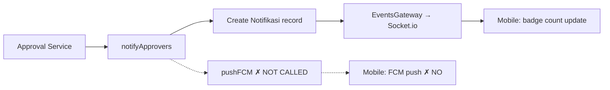
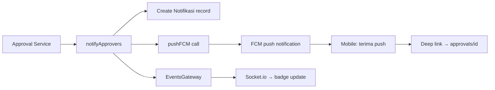

# PRD: Push Notification — Approval Request

> **Feature:** Admin penerima notifikasi mendapat push notification ketika ada approval request baru, dengan deep link langsung ke halaman approval detail.
> **Target release:** Sprint 4
> **Effort estimate:** 2–3 hari

---

## 1. Latar Belakang

BRD alur #2 *(registrasi → approval berjenjang)* dan #7 *(klaim → approval → pembayaran)*: Admin perlu segera tahu ketika ada pengajuan baru yang perlu ditindaklanjuti.

**Masalah saat ini:**
1. **Backend** — `notifyApprovers()` di approval.service.ts **hanya membuat in-app notification** (record di tabel `notifikasi`), **tidak mengirim FCM push notification**. Admin tidak dapat notifikasi di HP.
2. **Mobile** — `fcm.ts` sudah punya listener untuk `onNotificationTapped`, tapi **tidak ada handler untuk deep link** ke screen approval detail.
3. **Admin harus polling** — buka app → cek notifikasi → lihat daftar → tap → approval detail. Tidak ada trigger real-time.

**Dampak:** Approval bisa tertunda berjam-jam karena admin tidak tahu ada pengajuan baru.

### Arsitektur Existing



### Yang Dibutuhkan



---

## 2. User Stories

| ID | Sebagai… | Saya ingin… | Sehingga… |
|:---|:----------|:------------|:----------|
| US-01 | Admin | Menerima push notification ketika ada approval baru | Saya langsung tahu tanpa buka app |
| US-02 | Admin | Tap push notification → langsung ke detail approval | Saya tidak perlu mencari di menu |
| US-03 | Admin | Push notification menampilkan tipe + level approval | Saya bisa prioritaskan dari lock screen |
| US-04 | Admin | Notifikasi juga muncul sebagai in-app notification | Saya bisa lihat riwayat di app |
| US-05 | Admin | Bisa atur preferensi notifikasi approval (on/off) | Saya tidak terganggu di luar jam kerja |
| US-06 | Admin | Notifikasi ketika level saya yang berikutnya | Saya hanya dapat notifikasi relevan |

---

## 3. Backend Changes

### 3.1 Perubahan di `approval.service.ts`

**Lokasi**: `notifyApprovers()` method — setelah membuat in-app notification, tambahkan panggilan FCM push.

```typescript
// Existing: create in-app notification
await this.prisma.notifikasi.create({
  data: {
    userId: approver.id,
    tipe: 'umum',
    judul: 'Persetujuan Dibutuhkan',
    isi: `Ada pengajuan baru yang membutuhkan persetujuan Anda (Level: ${level.name})`,
  },
});

// NEW: trigger FCM push via notif service
await this.notificationsService?.send(approver.id, {
  judul: '✅ Persetujuan Dibutuhkan',
  isi: `${level.name}: ${requestTypeLabel} — ${itemSummary}`,
  tipe: 'approval_request',
  data: { approvalId: requestId, screen: 'approvals', screenId: requestId },
});
```

**Yang perlu di-inject**: `NotificationsService` ke `ApprovalService` constructor.

### 3.2 Approval-specific Notification Type

Tambahkan tipe notifikasi baru `approval_request` ke:

| Lokasi | Perubahan |
|:-------|:----------|
| `NOTIFICATION_TYPES` di notifications.service.ts | Tambah `{ key: 'approval_request', label: 'Persetujuan', description: 'Notifikasi saat ada pengajuan baru yang perlu disetujui' }` |
| `TYPE_ICONS` di mobile `use-notifications.ts` | Tambah `approval_request: '✅'` |

### 3.3 API Perubahan

**Tidak ada endpoint baru** — semua perubahan di backend bersifat internal:

| Change | File | Deskripsi |
|:-------|:-----|:----------|
| Inject NotificationService | `approval.service.ts` | Tambah constructor injection |
| Call pushFCM after in-app notif | `approval.service.ts` | `notifyApprovers()` → `this.notificationsService.send()` |
| Add notif type constant | `notifications.service.ts` | `approval_request` ke NOTIFICATION_TYPES |
| Add data payload | `approval.service.ts` | `{ approvalId, screen: 'approvals', screenId: requestId }` untuk deep link |

---

## 4. Mobile Changes

### 4.1 Deep Link Handler — Update `app/_layout.tsx`

Mobile sudah punya FCM notification listeners di `fcm.ts`. Yang perlu ditambah: handler untuk notification `data.screen` → navigasi ke route yang sesuai.

```typescript
// Di app/_layout.tsx — setelah FCM init
import { setupNotificationListeners } from '../src/lib/fcm';

// Register notification tap handler
useEffect(() => {
  const cleanup = setupNotificationListeners(
    (notification) => {
      // Received while app is open — badge count already handled by socket
    },
    (response) => {
      // Tapped from notification tray
      const data = response.notification?.request?.content?.data;
      if (data?.screen === 'approvals' && data?.screenId) {
        router.push(`/approvals/${data.screenId}`);
      }
    },
  );
  return cleanup;
}, []);
```

### 4.2 Notification Type Icon — Update `use-notifications.ts`

```typescript
export const TYPE_ICONS: Record<string, string> = {
  // ... existing ...
  approval_request: '✅',
};
```

### 4.3 Badge Count on Notifications Tab

Badge count **sudah ada** di tab notifikasi (via WebSocket `notification:count` event). Setelah FCM push diterima dan app dibuka, socket akan mengirim count update.

**Tidak perlu perubahan** — badge count sudah berfungsi.

---

## 5. Files to Create/Modify

### Backend (2 files modified)

| File | Action | Perubahan |
|:-----|:-------|:----------|
| `apps/api/src/modules/approvals/approval.service.ts` | **MODIFIKASI** | Inject NotificationsService, tambah panggilan `.send()` setelah in-app notif |
| `apps/api/src/modules/approvals/approvals.module.ts` | **MODIFIKASI** | Import NotificationsModule atau provider |

### Frontend Mobile (3 files modified)

| File | Action | Perubahan |
|:-----|:-------|:----------|
| `app/_layout.tsx` | **MODIFIKASI** | Tambah deep link handler di `setupNotificationListeners` onNotificationTapped |
| `hooks/use-notifications.ts` | **MODIFIKASI** | Tambah `approval_request: '✅'` ke TYPE_ICONS |
| `app/(tabs)/notifications.tsx` | **Tidak perlu** | Badge count sudah ada via WebSocket |

**Total: 5 files modified, 0 files created.**

---

## 6. Dependencies

| Dep | Untuk | Status |
|:----|:------|:------|
| `expo-notifications` | FCM push token & notification handler | ✅ Existing |
| `expo-device` | Detect physical device | ✅ Existing |
| Backend: NotificationsService.send() | Trigger FCM push | ✅ Existing |
| Backend: firebase-admin | Send FCM via Firebase Cloud Messaging | ✅ Existing |
| Backend: EventsGateway | Real-time badge count | ✅ Existing |
| Socket.io | Real-time notification count update | ✅ Existing |

**Tidak ada dependencies baru yang perlu diinstall.**

---

## 7. API Reference

### Backend: Panggilan NotificationsService.send()

```typescript
// Di approval.service.ts — after in-app notification creation
await this.notificationsService.send(approver.id, {
  judul: '✅ Persetujuan Dibutuhkan',
  isi: `${level.name}: ${this.getRequestTypeLabel(request.requestType)}`,
  tipe: 'approval_request',
  data: {
    approvalId: requestId,
    screen: 'approvals',
    screenId: requestId,
  },
});
```

### NotificationsService.send() — Flow

```
notificationsService.send(userId, dto)
  → Check user preference for tipe 'approval_request' (default: enabled)
  → Create record in notifikasi table
  → Send email notification (if enabled)
  → pushFCM(userId, title, body)
    → Get device tokens for userId
    → firebase-admin.messaging().sendEachForMulticast()
      → Data payload: { screen, screenId }
    → On failure: mark token inactive
  → EventsGateway.sendNotification() → Socket.io
  → EventsGateway.sendUnreadCount() → badge update
  → Invalidate cache
```

### Mobile: Notification Data Payload

```typescript
// Payload dari FCM push
interface NotificationData {
  screen?: string;     // 'approvals'
  screenId?: string;   // approval request UUID
  approvalId?: string; // same as screenId
}

// Tap → onNotificationTapped → check data.screen
// → router.push(`/approvals/${data.screenId}`)
```

---

## 8. UI Mockup

### Push Notification (Lock Screen)

```
┌─────────────────────────────────┐
│      THS-THM System             │
│                                 │
│  ✅ Persetujuan Dibutuhkan      │
│  Admin Ranting: Pembuatan       │
│  Anggota Baru — Andi Pratama    │
│                                 │
│         [Buka App]              │
└─────────────────────────────────┘
```

### Tap → Deep Link → Approval Detail

```
Push Notification
    │ Tap "Buka App"
    ▼
router.push('/approvals/{screenId}')
    │
    ▼
Approval Detail Screen (existing)
  → Status header, info, actions, timeline
  → Admin bisa langsung Setujui / Tolak
```

---

## 9. Validasi & Error States

| Skenario | Validasi | Penanganan |
|:---------|:---------|:-----------|
| Device token expired | FCM error `NotRegistered` | `pushBroadcast()` auto-mark token inactive ✅ |
| User menonaktifkan notif approval | Preference check | Notifikasi tidak dikirim ✅ |
| App di background | Expo-notifications handle `shouldShowAlert: true` | Notif muncul di notification tray ✅ |
| App di foreground | `addNotificationReceivedListener` | Notif diterima tapi tidak ditampilkan sebagai push (hanya badge count update via socket) ✅ |
| Deep link screen tidak dikenal | Fallback: router ke halaman approvals list | ✅ |
| Multiple level approvers | Loop `notifyApprovers()` → kirim ke semua user dengan role sesuai | ✅ (existing pattern) |

---

## 10. Acceptance Criteria

- [ ] US-01: Admin menerima push notification ketika approval baru dibuat untuk level yang sesuai dengan role-nya
- [ ] US-02: Push notification berisi judul "✅ Persetujuan Dibutuhkan" + deskripsi level + tipe
- [ ] US-03: Tap push notification → langsung navigasi ke `approvals/{approvalId}`
- [ ] US-04: Notifikasi juga muncul sebagai in-app notification di tab Notifikasi
- [ ] US-05: Badge count di tab Notifikasi terupdate setelah push
- [ ] US-06: Backend tidak crash jika FCM tidak dikonfigurasi (try-catch existing)
- [ ] US-07: User bisa atur preferensi notifikasi approval via halaman preferensi existing
- [ ] US-08: Jika notifikasi ditap saat app di background → deep link bekerja
- [ ] US-09: Jika notifikasi ditap saat app di foreground → tidak duplikat dengan in-app notification

---

## 11. Alur Lengkap

```
Superadmin/Admin membuat approval request baru (via web)
  ↓
ApprovalService.submit()
  → Buat approval request + levels
  → Panggil notifyApprovers() untuk level 1
    → Buat in-app notification
    → Panggil NotificationsService.send() ← NEW
      → In-app notif record
      → pushFCM(adminId, title, body) ← NEW
        → Firebase FCM → push notification di HP admin
      → Socket.io → update badge count
        ↓
Admin menerima push notification di lock screen
  ↓
Admin tap notification
  ↓
App opens → onNotificationTapped handler
  → Read data.screen === 'approvals'
  → router.push(`/approvals/${data.screenId}`)
  → Approval Detail Screen
  → Admin review & Setujui/Tolak
```

---

## 12. Current Status

| Komponen | Status | Keterangan |
|:---------|:-------|:-----------|
| FCM token registration | ✅ Existing | `fcm.ts:registerForPushNotifications()` |
| Notification channel (Android) | ✅ Existing | `fcm.ts:setNotificationChannelAsync()` |
| Notification handler | ✅ Existing | `fcm.ts:Notifications.setNotificationHandler()` |
| Notification listeners | ✅ Existing | `fcm.ts:setupNotificationListeners()` |
| FCM push backend | ✅ Existing | `notifications.service.ts:pushFCM()` |
| Socket.io real-time | ✅ Existing | Badge count update on new notif |
| **Notify approvers → in-app notif** | ✅ Existing | Hanya in-app, belum push |
| **Notify approvers → FCM push** | ❌ **Perlu ditambah** | Inject + call `notificationsService.send()` |
| **Deep link handler** | ❌ **Perlu ditambah** | `onNotificationTapped` → router.push |
| **Approval notif type icon** | ❌ **Perlu ditambah** | `approval_request: '✅'` di use-notifications.ts |

---

*Dokumen ini dapat dijadikan acuan untuk implementasi Sprint 4. Backend infrastructure (FCM, firebase-admin, socket.io) sudah siap — hanya perlu menghubungkan approval.service dengan notificationsService.send(). Mobile hanya perlu menambah deep link handler.*

*Perubahan minimal: 5 files (3 mobile, 2 backend). Tidak ada dependencies baru.*
